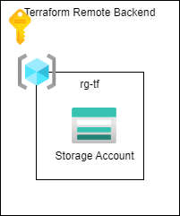

# Terraform - Azure - Setup Remote Backend

## Table of Contents

* [Introduction](#introduction)
* [Scripts](#scripts)
* [Resources](#resources)

## Introduction

Templates the setup the Terraform remoate backend in Azure.

## Azure Infrastructure

## Scripts

### `add_service_principal.sh`
* Creates a Service Principals setup of the Azure infrastructure.
* The password for the service principal expires after 5 years.
* If roles must be assigned to users with the service principal, then the service principal must be given the role `User Access Adminstrator`.

### `add_storage_account.sh`
* The prerequisite is the above service principal.
* Creates a resource group.
* Creates an Azure Storage Account.
* Creates a container in the Azure Storage Account.
* Sets firewall rules on the Azure Storage Account, if necessary..

### `deployment.ps1` und `deployment.sh`
* Scripts can be used as the basis for a local deployment of Azure resources in a PowerShell session or BASH session.
* The prerequisite is the installation of the [Azure CLI](https://docs.microsoft.com/de-de/cli/azure/install-azure-cli) and [terraform](https://www.terraform.io/downloads).

#### Terraform environment variables
  * `ARM_CLIENT_ID="00000000-0000-0000-0000-000000000000"` App ID des Service Principal (not the Object ID)
  * `ARM_CLIENT_SECRET="00000000-0000-0000-0000-000000000000"` Client secret des Service Principals
  * `ARM_SUBSCRIPTION_ID="00000000-0000-0000-0000-000000000000"` Azure Subscription ID
  * `ARM_TENANT_ID="00000000-0000-0000-0000-000000000000"` Tenant ID
  * `TF_VAR_client_secret="00000000-0000-0000-0000-000000000000"` Variable is declared in the file `main.tf` and Terraform reads the value from the environment variable.
  * `TF_CLI_ARGS_init` parameter for the `terraform init` command.
  * `TF_CLI_ARGS_plan` parameter for the `terraform plan` command.
  * `TF_CLI_ARGS_apply` parameter for the `terraform apply` command.
  * `TF_CLI_ARGS_destroy` parameter for the `terraform destroy` command.

#### User specific variables
  * `TF_STATE_ENV="<customer>-<project>-<environment>"` ID of the state file.
    * `<customer>` three characters of the customer.
    * `<project>` three characters of the project
    * `<environment>` up to four characters `dev|int|poc|prod|qa|test`  * `TF_STATE_STORAGE_ACCOUNT_NAME="<STORAGE_ACCOUNT_NAME>"` name of the Azure Storage Account.
  * `TF_STATE_CONTAINER_NAME="statefiles"` name of the container in the Azure Storage Account.
  * `TF_STATE_KEY="${TF_STATE_ENV}.tfstate"` name of the state file in the container.

## Resources

[Create a service principal](https://learn.microsoft.com/en-us/azure/developer/terraform/authenticate-to-azure?tabs=bash#create-a-service-principal)

[Store Terraform state in Azure Storage](https://learn.microsoft.com/en-us/azure/developer/terraform/store-state-in-azure-storage?tabs=azure-cli)
